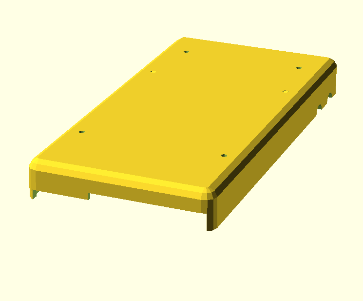
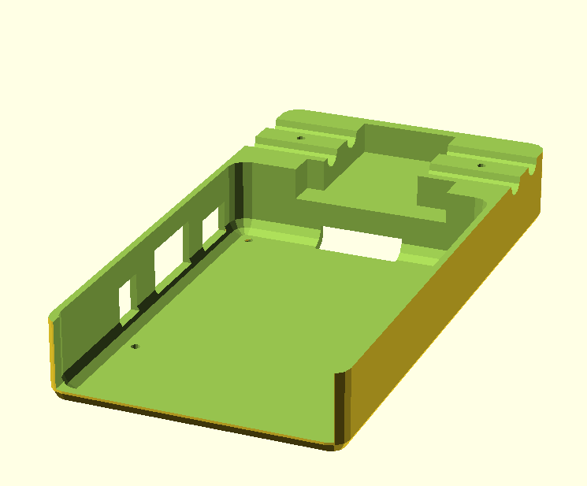

# Raspi2_case

Raspberry Pi2 case in openscad

3D printable Raspberry Pi case.

# design

`make design`

# print

## all

make both top and bottom STL files

`make`

## TOP

make only top STL file

`make top`

## bottom

make only bottom STL file

`make bottom`
