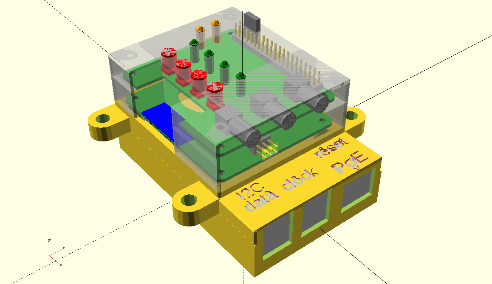
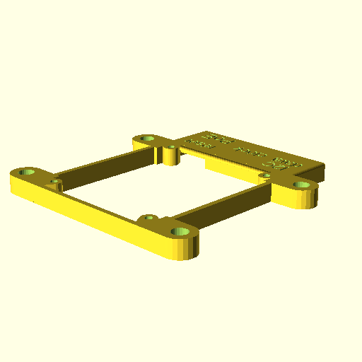
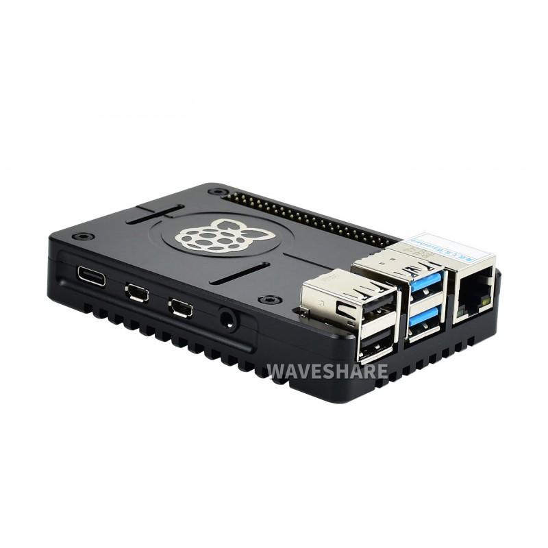

# RPi4_case

Raspberry Pi4 case in openscad

3D printable Raspberry Pi case.

# design

`make design`

# print

## all

make STL files

`make`

## stack

make only SLICE=[lower,middle,upper,cover] STL file

`make $SLICE`, e.g. `make cover`
