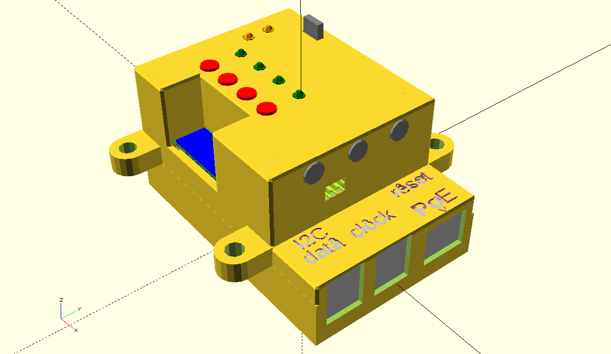

# RPi4_case

Raspberry Pi4 case in openscad

3D printable Raspberry Pi case.

# design

`make design`

# print

## all

make STL files

`make`

## stack

make only SLICE=[lower,middle,upper,cover] STL file

`make $SLICE`, e.g. `make cover`

# dev.

## TODO

- put oLED in projection (and PCB contours and hole only)
- text with OpenSCAD version higher
- check sizes: USB, Eth, hole for oLED (PCB <-> cover box)
- screwing procedure
- move code to files: box_stack.scad, HAT.scad, devices.scad, LEMO_HAT.scad, ...
- add make projection, make STL, ...

## BUG

- cover box without PCB diff. (too much objects, choose either PCB or LED difference, not both)
