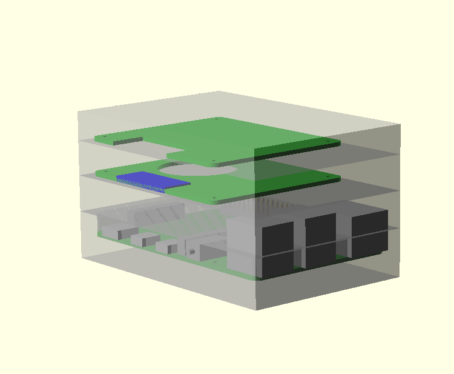
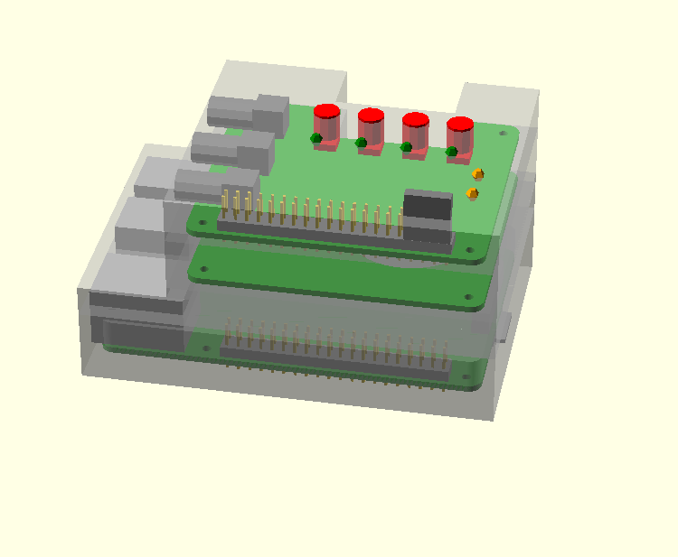
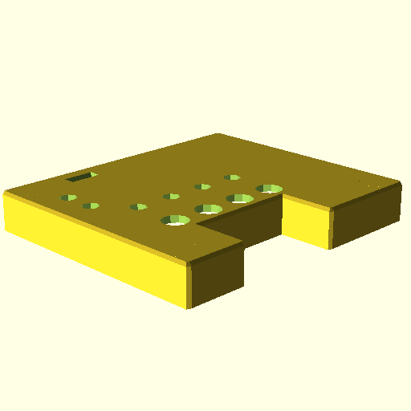
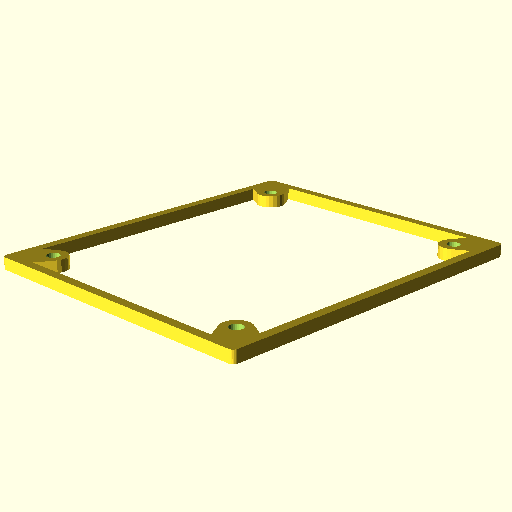
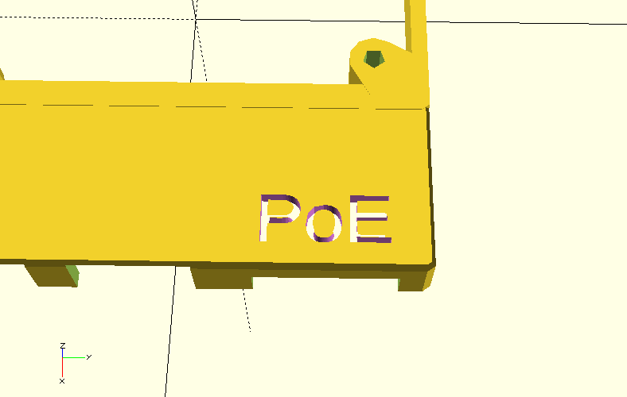
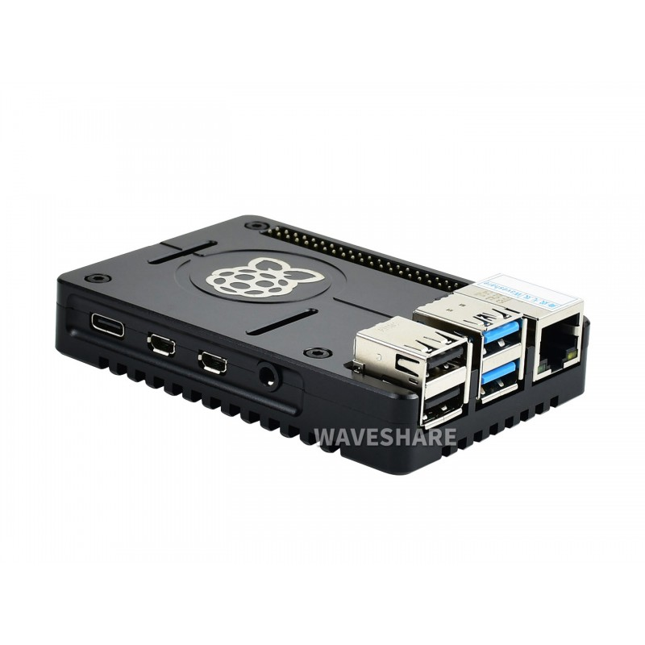
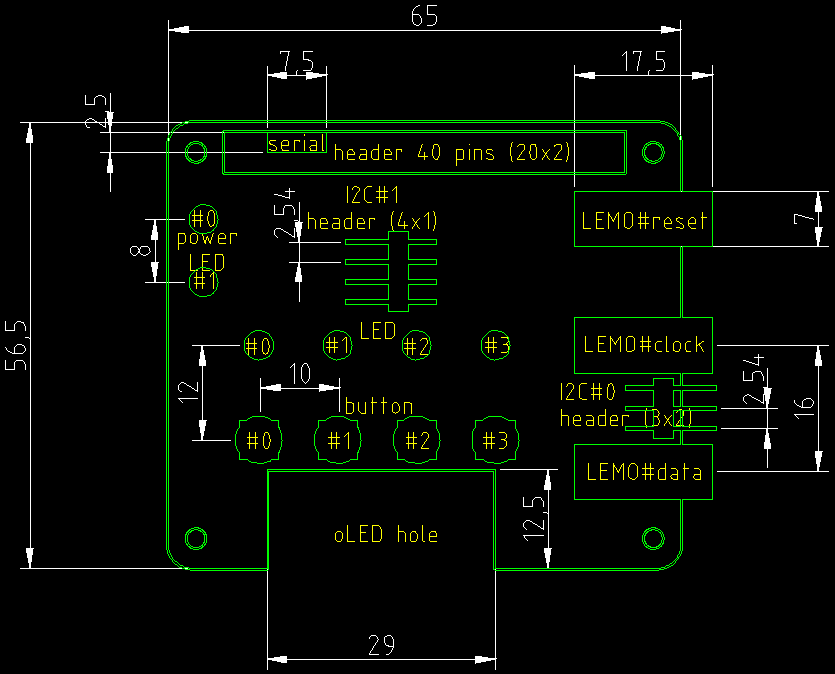
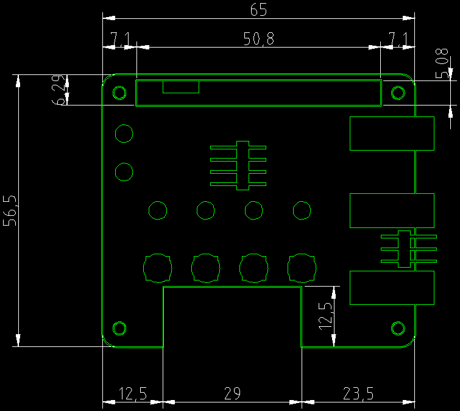
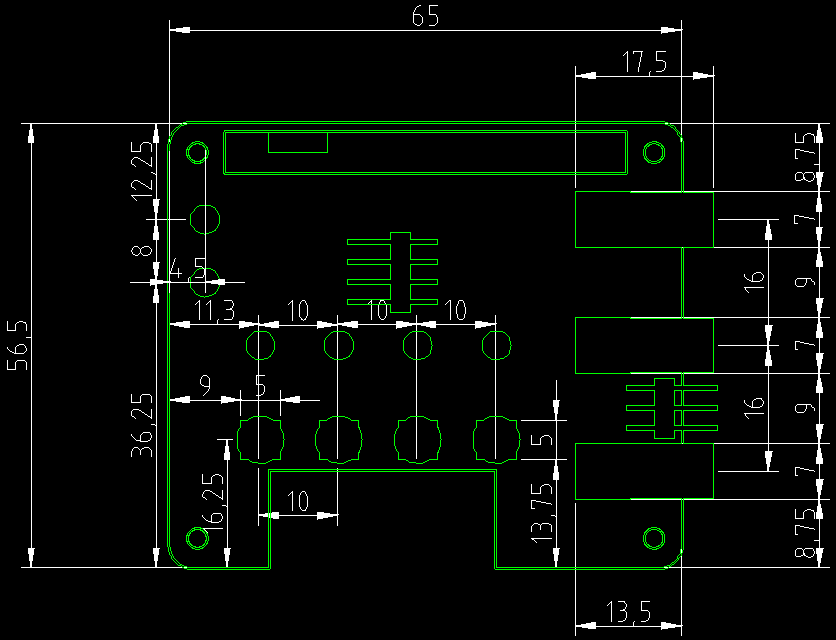

<!--- begin@of@TOC --->
# Table of contents

1. [RPi4_case](#rpi4_case)
1. [design](#design)
1. [print](#print)
     - [all](#all)
     - [stack](#stack)
1. [foot print](#foot-print)
     - [dimensions](#dimensions)
1. [dev.](#dev)
     - [DONE](#done)
     - [TODO](#todo)
          - [high priority](#high-priority)
          - [medium priority](#medium-priority)
          - [low priority](#low-priority)
     - [BUG](#bug)
<!--- end@of@TOC --->

# RPi4_case

Raspberry Pi4 case in openscad

3D printable Raspberry Pi case.

# design

`make design`

# print

## all

make STL files

`make -j4 stl`

## stack

make only SLICE=[lower,middle,upper,cover] STL file

`make $SLICE`, e.g. `make cover`

# foot print

`make -j2 projection`

or

`make -j2 projection.svg projection.dxf`

## dimensions

# dev.

## DONE

- v add PCB contours and hole in projection
- v ContinuousIntegration for GitLab
- v add header contour in projection

## TODO

### high priority

- _ add temperature probe holer on lower box
- _ add oLED in projection

### medium priority

- _ check sizes: USB, Eth, hole for oLED (PCB <-> cover box)
- _ screwing procedure
- _ add bars on a, o and e letters
- _ add integrated buttons ?

### low priority

- _ move code to files: box_stack.scad, HAT.scad, devices.scad, LEMO_HAT.scad, ...
- _ design version text for all boxes (print on hidden side !)

## BUG

- o OpenSCAD 2015.03: after many F5 render, empty render, but F6 is ok, reload OpenSCAD !
