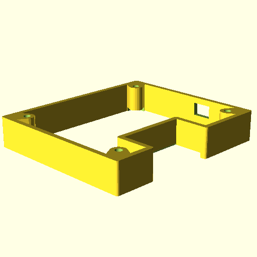

# RPi4_case

Raspberry Pi4 case in openscad

3D printable Raspberry Pi case.

# design

`make design`

# print

## all

TODO

make STL files

`make`

## stack

WinP

make only SLICE=[lower,middle,upper,cover] STL file

`make $SLICE`, e.g. `make cover`

# dev.

# DONE

- v minkowski on PCB differences (instead of for(m... ) + fast operation in library

## TODO

### high priority

- _ add temperature probe holer on lower box
- . put oLED in projection (and PCB contours and hole only)

### medium priority

- _ check sizes: USB, Eth, hole for oLED (PCB <-> cover box)
- _ screwing procedure

### low priority

- _ move code to files: box_stack.scad, HAT.scad, devices.scad, LEMO_HAT.scad, ...
- _ add make projection, make STL, ...
- _ design version text for all boxes (print on hidden side !)

## BUG

- OpenSCAD 2015.03: after many F5 render, empty render, but F6 is ok, reload OpenSCAD !
